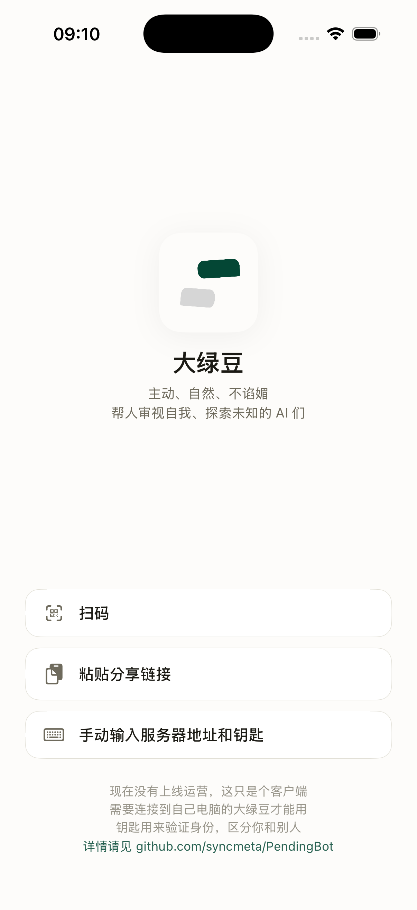

<p align="center">
  
</p>

<h1 align="center">大绿豆 · PendingBot</h1>

<p align="center">
  一个有主动性的 AI 朋友 — 主动对话、自己冲浪、不拍马屁。
  <br />
  <em>An AI companion with initiative — proactive, web-surfing, never sycophantic.</em>
</p>

<p align="center">
  <a href="LICENSE"></a>
  <a href="https://bun.sh"></a>
  
  
  <a href="https://github.com/syncmeta/PendingBot/stargazers"></a>
  <a href="https://github.com/syncmeta/PendingBot/commits/main"></a>
  
</p>

<p align="center">
  <a href="README.md">中文</a> · <a href="README_EN.md">English</a>
</p>

<p align="center">
  
</p>

---

## ✨ 这是什么

两大目标：

- 🗣️ **和人自然地交流 主动对话 不谄媚** — 和微信聊天一样，让它心里有你，不拍你马屁
- 🌊 **审视自我 探索未知 做信息的 VC** — 自己上网冲浪，从使用者的利益出发，寻找他真正需要的东西

我想让它给我推送我认知以外、又真正需要的东西，帮助我意识到自己所忽略的、不足的东西。它有主动性，不是你问一句它答一句。它/它们可以由一人养育，也可以和好友一起养育。

> 不是助手类工具——助手类应用大把人做，没必要重复造轮子。也不是标准的 AI 陪伴——解决的需求不在于缺爱了想找个 AI 陪或者无聊了想找个人聊天。
>
> 我期望它能帮人生活得更好——给出靠谱的建议、指出自己意识不到的问题、提供有价值的信息、提供更好的生活方式与计划。这非常难实现，人都很难做到。不论如何，先试试。

## 🚀 核心特性

| | |
|---|---|
| 🧠 **主动对话** | 微信式语气、防抖打断、自我反思（每 N 轮反观一次最近聊天） |
| 🌊 **网络冲浪** | 主动搜索 + 深挖 + 漫游 + curator 筛选，把真正有价值的东西讲给你听 |
| 👥 **多 Bot 共存** | 每个 Bot 有自己的性格 / 模型 / 访问权限，可一人一养也可几人共养 |
| 🌐 **多端接入** | Web、iOS（原生 SwiftUI）、Telegram、飞书，所有能力跨端一致 |
| 🎯 **OpenRouter 模型路由** | 任意模型组合：主对话 / 防抖 / 反思 / 冲浪 / 标题各自独立配置 |
| 🛠️ **Agent Skills** | 内置 Anthropic skill-creator 等预设，亦可自写 Markdown 技能 |
| 🧩 **热重载提示词** | `prompts/` 下任意 `.md` 改完即生效，不必重启 |
| 🔐 **Honcho 用户记忆** | 可选接入，记住用户长期信息与偏好 |

## 📑 目录

- [快速开始](#-快速开始)
- [环境变量](#-环境变量)
- [配置 Bot](#-配置-bot)
- [编写性格](#-编写性格)
- [使用](#-使用)
- [接入 Telegram / 飞书](#-接入-telegram--飞书)
- [接入 iOS](#-接入-ios)
- [技能（Skills）](#-技能skills)
- [技术栈](#-技术栈)
- [致谢与第三方组件](#-致谢与第三方组件)
- [License](#-license)

## 🚀 快速开始

需要 [Bun](https://bun.sh) 运行时。后端代码在 `main/` 子目录下，所有 `bun` 命令都在那里跑。

```bash
cd main
bun install
```

## 🔑 环境变量

在 `main/` 下复制 `.env.example` 为 `.env`，填入以下内容：

| 变量 | 必填 | 说明 |
|------|------|------|
| `OPENROUTER_API_KEY` | 是 | [OpenRouter](https://openrouter.ai) API Key |
| `HTTPS_PROXY` | 否 | 代理地址，网络不通时使用（`HTTP_PROXY` / `ALL_PROXY` 同样生效） |
| `JINA_API_KEY` | 否 | Jina 搜索 Key，用于冲浪功能 |
| `HONCHO_API_KEY` | 否 | Honcho Key，用于用户记忆 |
| `HONCHO_BASE_URL` | 否 | Honcho API 地址，自托管时填写 |
| `HONCHO_WORKSPACE_ID` | 否 | Honcho 工作区 ID |

## ▶️ 启动

```bash
cd main
bun run dev          # 开发模式（文件变动自动重启）
bun run start        # 生产模式
```

打开 `http://localhost:3456`。

## ⚙️ 配置 Bot

编辑 `main/config.yaml`：

```yaml
server:
  port: 3456
  host: "0.0.0.0"

openrouter:
  defaultModel: "anthropic/claude-sonnet-4.6"   # 主对话模型
  debounceModel: "openrouter/free"              # 防抖用的便宜模型
  reviewModel: "anthropic/claude-sonnet-4.6"    # 自我反思模型
  surfingModel: "x-ai/grok-4.20"                # 冲浪模型
  titleModel: "openrouter/free"                 # 生成对话标题；不填则复用 debounceModel

# 所有 bot 共享的默认开关，per-bot 段里只写需要覆盖的字段
defaults:
  accessMode: "open"              # open / approval / private
  review:
    enabled: true
    roundInterval: 8              # 每 8 轮反思一次
  surfing:
    enabled: true
    autoTrigger: false            # 是否自动定期冲浪
  debounce:
    enabled: true

bots:
  my_bot:
    displayName: "起个名字"
    promptFile: "my_bot.md"       # 对应 prompts/bots/my_bot.md
    # 以下都可选
    model: "..."                  # 覆盖默认模型
    accessMode: "private"         # 覆盖访问模式
    creators: ["user_id_1"]       # accessMode 为 approval / private 时的白名单
    review:
      roundInterval: 4            # 只覆盖这一项，其他沿用 defaults
    surfing:
      autoTrigger: true
```

可以定义多个 Bot，各有各的性格和配置。更多可调参数（`timerMs`、`maxSearchRequests`、`initialIntervalSec`、`maxIntervalSec`、`idleStopSec`、`maxRequests`、`maxWaitMs`、`serendipityEveryN`、`dedupWindowDays` 等）见 [`main/src/config/schema.ts`](main/src/config/schema.ts)。

## 🎭 编写性格

在 `main/prompts/bots/` 下创建 `.md` 文件，写你想让 Bot 成为什么样的存在。没有固定格式，随便写。仓库自带 `default.md` 作为示例与兜底。

系统级的规则在 `main/prompts/system.md`（微信风格的对话）和 `main/prompts/system-normal.md`（标准 AI 助手风格），由前端的 tone 开关切换，通常不需要改。

所有提示词支持热重载 — 改完直接生效，不用重启。

```
main/prompts/
├── system.md              # 核心规则：微信风格（默认）
├── system-normal.md       # 核心规则：标准 AI 风格
├── bots/
│   └── default.md         # Bot 性格（自带示例，可新增）
├── review.md              # 自我反思的行动提示
├── review-eval.md         # 反思后对搜索结果的筛选
├── review-followup.md     # 反思后的跟进
├── surfing.md             # 冲浪总控
├── surfing-wanderer.md    # 漫游：跟着好奇心乱逛
├── surfing-digger.md      # 深挖：围绕一个话题往下钻
├── surfing-curator.md     # 从漫游结果里筛出真正有价值的
├── surfing-synthesizer.md # 把多源材料综合成一段叙述
├── surfing-mode-fresh.md  # 冲浪模式：抓最新动态
├── surfing-mode-depth.md  # 冲浪模式：深度挖掘
├── surfing-mode-granular.md # 冲浪模式：颗粒度细的事实抓取
├── debate.md              # 多 Bot 议论
├── portrait/              # 用户画像生成
└── title.md               # 为对话生成标题
```

冲浪默认走基于向量的深挖（digger），低频会烧一格"漫游 + curator"的 serendipity 槽位保留跨域惊喜（频率由 `serendipityEveryN` 控制）。

## 💬 使用

### 聊天

打开网页，选一个 Bot，开始聊。

### 触发冲浪

在聊天中发送 `/surf`，Bot 会去互联网上搜索它认为你需要的信息，然后自然地跟你聊。

如果在 config 里开了 `autoTrigger`，它会自己定期去冲浪，不需要你手动触发。

### 清空对话

在网页对话标题栏的菜单里直接「清空当前对话」即可（背后调的是 `POST /api/conversations/reset`，需要登录态）。iOS 端在对话设置里也有同样的按钮。

### Token 用量

点左下角「使用统计」查看各模型、各任务类型的 token 消耗和费用。

## 🤖 接入 Telegram / 飞书

除了网页聊天，每一个 Bot 都可以拥有自己的 Telegram 机器人账号和飞书应用——配置里有多少个 Bot，就对应多少个外部账号。防抖、冲浪、自我反思等能力在所有平台上一致工作。

平台配置写在对应 Bot 的条目下，形如：

```yaml
bots:
  alice:
    displayName: "Alice"
    promptFile: "alice.md"
    telegram:
      enabled: true
      token: ""                # 或环境变量 TELEGRAM_TOKEN_ALICE
      # webhookUrl: "https://host/webhook/telegram/alice"   # 不填则用 polling
    feishu:
      enabled: true
      appId: ""                # 或环境变量 FEISHU_APP_ID_ALICE
      appSecret: ""            # 或环境变量 FEISHU_APP_SECRET_ALICE
  bob:
    displayName: "Bob"
    promptFile: "bob.md"
    telegram:
      enabled: true
      token: ""                # 或环境变量 TELEGRAM_TOKEN_BOB
```

每个 Bot 在不同平台独立——Alice 在 Telegram 有自己的账号和头像，在飞书也有自己的应用。用户在 Telegram 里搜 `@alice_bot` 就是和 Alice 聊，搜 `@bob_bot` 就是和 Bob 聊，两边完全独立。

**环境变量命名规则：** `TELEGRAM_TOKEN_{BOT_ID}` / `FEISHU_APP_ID_{BOT_ID}` / `FEISHU_APP_SECRET_{BOT_ID}`，把 bot id 大写、非字母数字字符替换成 `_`。比如 bot id `alice` 对应 `TELEGRAM_TOKEN_ALICE`。

所有平台只接收**接入之后**的新消息，不会回溯历史。

### Telegram

每个想接入 Telegram 的 Bot 按以下步骤操作：

1. 在 Telegram 里找 [@BotFather](https://t.me/BotFather)，发 `/newbot` 创建一个机器人账号，拿到 `token`（形如 `1234:ABC...`）。给每个 Bot 都建一个独立账号。

2. 把 token 写进 `.env`（推荐）：

   ```
   TELEGRAM_TOKEN_ALICE=1234:ABC...
   TELEGRAM_TOKEN_BOB=5678:DEF...
   ```

   或者直接填进 `config.yaml` 对应 Bot 的 `telegram.token`（不推荐）。

3. 在该 Bot 的配置下打开 telegram：

   ```yaml
   bots:
     alice:
       # ...
       telegram:
         enabled: true
   ```

4. 启动服务。默认使用 **polling 模式**（长轮询 Telegram 拉消息），本地开发直接能用，不需要公网。每个 Bot 独立跑一个 polling 循环。

   部署到有公网的机器上时，可以给单个 Bot 设 `webhookUrl`，启动时自动调用 Telegram 的 `setWebhook`。URL 规则是 `https://host/webhook/telegram/{botId}`，比如 Alice 是 `https://your-domain.com/webhook/telegram/alice`。URL 必须是 HTTPS。

5. 在 Telegram 里搜对应的 Bot 用户名，发消息即可。发 `/surf` 可以手动触发冲浪。

### 飞书

每个想接入飞书的 Bot 按以下步骤操作：

1. 在[飞书开放平台](https://open.feishu.cn/app)创建一个「自建应用」，拿到 **App ID** 和 **App Secret**。每个 Bot 建独立的应用。

2. 在应用的「权限管理」里开启：
   - `im:message`（发送消息）
   - `im:message.p2p_msg`（接收单聊消息）
   - `im:message.group_at_msg`（接收群聊 @ 消息，可选）

3. 在「事件与回调」→「事件配置」里：
   - 请求地址设为 `https://your-domain.com/webhook/feishu/{botId}`（必须是公网 HTTPS）。比如 Alice 是 `https://your-domain.com/webhook/feishu/alice`。
   - 订阅事件：`接收消息 v2.0`（`im.message.receive_v1`）

4. 把凭证写进 `.env`：

   ```
   FEISHU_APP_ID_ALICE=cli_xxx
   FEISHU_APP_SECRET_ALICE=xxx
   FEISHU_APP_ID_BOB=cli_yyy
   FEISHU_APP_SECRET_BOB=yyy
   ```

5. 在该 Bot 的配置下打开 feishu：

   ```yaml
   bots:
     alice:
       # ...
       feishu:
         enabled: true
   ```

6. 启动服务。在每个飞书应用的「版本管理与发布」里发布应用，然后在飞书里与对应 Bot 单聊即可。群聊需要 @ 机器人。

飞书事件回调必须是公网地址。本地开发可以用 [ngrok](https://ngrok.com/)、[frp](https://github.com/fatedier/frp) 之类做一层内网穿透。

## 📱 接入 iOS

仓库里附带一个原生 SwiftUI app，位于 `ios/PendingBot/`。覆盖六个 tab：消息 / 议论 / 冲浪 / 回顾 / 画像 / 你。

<p align="center">
  
</p>

和 Telegram / 飞书不同，iOS 不需要 per-bot 配置——一把「钥匙」（API key）就能访问服务上所有的 Bot。走的是独立的 `/api/mobile/*` REST 接口和 `/ws/mobile` WebSocket，全部用 `Authorization: Bearer <api_key>` 鉴权，key 加密存在 Keychain。

接入步骤：

1. 生成 Xcode 工程（项目用 [xcodegen](https://github.com/yonaskolb/XcodeGen) 管理）：

   ```bash
   brew install xcodegen
   cd ios
   xcodegen generate
   open PendingBot.xcodeproj
   ```

   第一次打开 Xcode 时，在 **Signing & Capabilities** 选你的 Apple Developer Team。

2. 启动后端（`cd main && bun run dev` 或 `bun run start`）。

3. 在网页端进入「钥匙」tab，新建一把 key。可以拿到一个完整的 key 字符串、一个分享链接、一个二维码。

4. Xcode 选模拟器或真机 ⌘R 运行。首次启动时三选一导入服务：

   - **粘贴分享链接**——直接把 web 上的 URL 贴进来，字段自动预填
   - **扫描二维码**——真机推荐
   - **手动输入**——服务器 URL（如 `http://192.168.x.x:3456`）+ key

5. 回到「消息」tab 挑一个 Bot 开始聊。发 `/surf` 同样可以手动触发冲浪。

iOS 上每把 key 对应服务端的一个独立用户——同一个人在 iOS 和网页上看到的是两份对话，除非分享同一把 key。

> 想让分享链接走公网（而不是本机检测到的 LAN IP），在 `main/config.yaml` 的 `server.publicURL` 填上你的域名。

iOS 端的更多细节（多账号、Universal Link、APNs 现状等）见 [ios/README.md](ios/README.md)。

## 🛠️ 技能（Skills）

「我」标签页里有「技能」区域，可以管理 Anthropic 风格的 [Agent Skills](https://github.com/anthropics/skills) — 一段带 frontmatter 的 Markdown 指令片段，启用后在聊天时会拼进系统提示词。

首次打开会从仓库自带的预设里播种以下几条（默认未启用），全部来自 [`anthropic/skills`](https://github.com/anthropics/skills)（Apache-2.0）：

| 预设 | 出处 |
|------|------|
| `skill-creator`     | https://github.com/anthropics/skills/blob/main/skills/skill-creator/SKILL.md |
| `mcp-builder`       | https://github.com/anthropics/skills/blob/main/skills/mcp-builder/SKILL.md |
| `doc-coauthoring`   | https://github.com/anthropics/skills/blob/main/skills/doc-coauthoring/SKILL.md |
| `internal-comms`    | https://github.com/anthropics/skills/blob/main/skills/internal-comms/SKILL.md |
| `brand-guidelines`  | https://github.com/anthropics/skills/blob/main/skills/brand-guidelines/SKILL.md |
| `theme-factory`     | https://github.com/anthropics/skills/blob/main/skills/theme-factory/SKILL.md |

预设的 SKILL.md 原文存放在 [`main/prompts/skills/anthropic/`](main/prompts/skills/anthropic/) 目录，附带 [NOTICE.md](main/prompts/skills/anthropic/NOTICE.md) 说明出处与许可。预设在你不修改 body 的前提下会随仓库更新；本地编辑过的预设不会被覆盖。

也可以在「新建技能」里写自己的技能 — 只填名字、一句话描述、Markdown 正文即可。

## 🧱 技术栈

<p>
  
  
  
  
  
  
  
</p>

后端：Bun + Hono + SQLite + OpenRouter + Jina MCP + WebSocket。
iOS：Swift + SwiftUI（XcodeGen）。

## 🙏 致谢与第三方组件

本项目除自身代码外使用以下开源组件，所有版权归原作者所有：

**运行时依赖**

- [Bun](https://bun.sh) — MIT
- [Hono](https://hono.dev) — MIT
- [OpenAI Node SDK](https://github.com/openai/openai-node) — Apache-2.0
- [Honcho SDK](https://github.com/plastic-labs/honcho) — Apache-2.0
- [Model Context Protocol SDK](https://github.com/modelcontextprotocol/typescript-sdk) — MIT
- [Zod](https://github.com/colinhacks/zod) — MIT
- [yaml (eemeli)](https://github.com/eemeli/yaml) — ISC
- [node-qrcode](https://github.com/soldair/node-qrcode) — MIT
- [Playwright](https://github.com/microsoft/playwright) — Apache-2.0（仅 dev / 脚本用途）

**外部服务**

- [OpenRouter](https://openrouter.ai) — 模型路由
- [Jina AI](https://jina.ai) — 搜索 / 抓取（MCP）
- 可选：Telegram Bot API、飞书开放平台、Apple Push Notification service

**预设技能内容**

- [anthropic/skills](https://github.com/anthropics/skills) — Apache-2.0 © Anthropic, PBC. 详见 [main/prompts/skills/anthropic/NOTICE.md](main/prompts/skills/anthropic/NOTICE.md)。

如发现遗漏请提 Issue。

## 🤝 贡献

欢迎 Issue 和 PR。提交前简单聊一下想法会更顺利——尤其是涉及提示词、冲浪管线、跨端协议这类核心改动。

- Bug / 新特性请走 [Issues](https://github.com/syncmeta/PendingBot/issues)
- 大改动建议先开 Discussion 或 Draft PR 对齐方向
- 代码风格跟现有文件保持一致；提示词改动请在 PR 说明改动动机

## 📄 License

本仓库代码以 [MIT](LICENSE) 协议发布。第三方组件遵循各自原协议（见上）。

---

<p align="center">
  Made with 💚 for people who want a friend that pushes back, not a tool that nods along.
</p>
